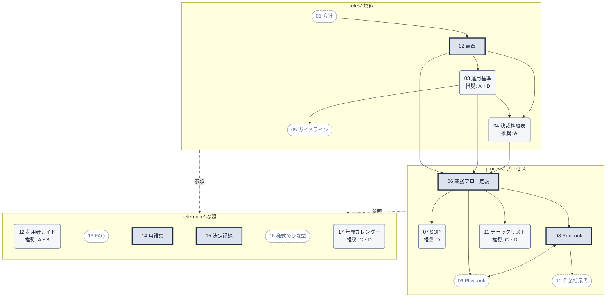

# ガバナンス文書標準テンプレート（govdoc-template）

IT部門に新しい機能を導入するときの**運営文書一式**の標準構成。
会議体で承認する機能にも、依頼を受けて支援する機能や定常運用の機能にも使えるよう、**機能の型**（§2-2）に応じて作る文書を選ぶ。

テーマで使うときの手順は **§4 立ち上げの手順**、各文書の構成・文体・図表の記法は **[記述仕様書](./SPEC.md)**、初期セットを作るときの作業の範囲と手順は **[作成指示書](./INSTRUCTIONS.md)**、変数・記法・文書管理の決まりは **§5〜§7** を参照する。

---

## フォルダ構成

```
govdoc-template/                       コピーしてテーマ名に変える（§4）
├─ README.md                           このファイル（文書の定義・立ち上げの手順・変数・記法・文書管理）
├─ SPEC.md                             記述仕様書（17文書の構成・文体・表記・図表の記法）
├─ INSTRUCTIONS.md                     初期セットの作成指示書（どこまで、どう作るか）
├─ rules/                              【規範】何を守るか
│  ├─ 01-policy.docx                   方針
│  ├─ 02-charter.docx                  憲章
│  ├─ 03-standard.docx                 運用基準
│  ├─ 04-delegation-of-authority.xlsx  決裁権限表
│  └─ 05-guideline.md                  ガイドライン
├─ process/                            【プロセス】どう動くか
│  ├─ 06-process-definition.pptx       業務フロー定義
│  ├─ 07-sop.docx                      標準作業手順書
│  ├─ 08-runbook.md                    Runbook
│  ├─ 09-playbook.md                   Playbook
│  ├─ 10-work-instruction.pptx         作業指示書
│  └─ 11-checklist.xlsx                チェックリスト
└─ reference/                          【参照】何を見ればよいか
   ├─ 12-handbook.pptx                 利用者ガイド
   ├─ 13-faq.md                        FAQ
   ├─ 14-glossary.md                   用語集
   ├─ 15-decision-log.xlsx             決定記録
   ├─ 16-form-template.docx            様式のひな型
   └─ 17-calendar.xlsx                 年間カレンダー
```

---

## 1. 目的

IT部門に新しい機能（例: IT投資ガバナンス、ベンダーマネジメント（VMO）、アクセス権の定期棚卸）を立ち上げるときに、「何を守るか」「どう動くか」「何を見ればよいか」を、抜けと重複なく文書として揃えられるようにする。

このテンプレートで解決したいこと:

- **文書間の食い違いを防ぐ。** 基準を1か所にだけ書き、他の文書はそこを参照する構成にする。
- **ルールを変えずに運用を改善できるようにする。** 承認の重い文書と軽い文書を分け、運用の見直しで規程の改訂が要らないようにする。
- **立ち上げに必要な文書を絞る。** 最初から全文書を揃えず、必須の文書と機能の型に合った推奨の文書で運用を始め、任意の文書は必要になったときに足す。

適用範囲は、IT部門の内部の機能（IT Management のケイパビリティマップに含まれるもの）とする。

---

## 2. 文書の定義

### 2-1. 文書体系（3層）

文書は、**変わりにくさ**と**承認の重さ**で3層に分ける。

| 層（上位から） | フォルダ | 役割 | 変わりやすさ | 承認 |
|---|---|---|---|---|
| 規範 | `rules/` | 何を守るか | 変わりにくい | 重い（経営層・会議体） |
| プロセス | `process/` | どう動くか | 運用で見直す | 軽い（事務局責任者） |
| 参照 | `reference/` | 何を見ればよいか | 随時更新 | 軽い（事務局責任者。定期見直しでまとめて確認してよい） |

- **下位の層の文書は、上位の層の文書を参照し、内容を書き写さない。** 例: 基準額は rules/ の運用基準に書き、process/ のRunbookからは「運用基準 第○条」と参照する。
- **層の間で食い違ったら、上位の層の文書を正とする。** rules > process > reference の順。
- **承認の例外は2つ。** ガイドライン（rules/）は推奨事項なので事務局責任者が承認し、SOP（process/）は品質・監査上の要求があるので運用基準と同じ承認者が承認する。文書ごとの所管と承認者は §7-2 を参照する。

### 2-2. 機能の型

最初にどの文書を整備するかは、導入する機能が**どう運営されるか**で決まる。機能を次の4つの型に当てはめ、§2-3 で作る文書を選ぶ。

| 型 | 運営のされ方 | 動き出すきっかけ | 例（IT Management のケイパビリティ） | 中心になる文書 |
|---|---|---|---|---|
| **A 決定・承認型** | 申請を受け、会議体・決裁者が可否や優先度を決める | 申請（起案） | 投資評価・優先順位付け、技術標準・アーキテクチャレビュー、変更管理、IT予算管理 | 憲章（会議体）、決裁権限表、利用者ガイド |
| **B 依頼・提供型** | 依頼・相談を受け、支援やサービスを提供する。決定は依頼者の側に残る | 依頼・相談 | 委託先の選定・契約（VMO）、サービスデスク・要求実現、ID管理 | 憲章（役割と責任）、Runbook、利用者ガイド（依頼者向け） |
| **C 定常運用型** | 決まった周期・イベントで作業を繰り返し、台帳や状態を正しく保つ | 周期・イベント | 監視・ジョブ運用、脆弱性管理、IT資産・ライセンス管理、構成管理 | Runbook、チェックリスト、年間カレンダー |
| **D 定期評価・統制型** | 決まった周期で点検・評価し、証跡を残す。監査で説明できることが求められる | 評価の周期・監査 | GxPシステムの定期レビュー、IT全般統制の評価、アクセス権の定期棚卸、委託先の評価・監督 | SOP、チェックリスト、年間カレンダー |

**選び方**

- **「誰が決めるか」で見分ける。** この機能（会議体を含む）が可否を決める → A。決めるのは依頼者で、この機能は支援・提供する → B。依頼がなくても周期やイベントで動く → C。目的が点検と証跡を残すこと → D。
- **1つの機能が複数の型を持つことが多い。** 例: VMO は相談対応が B、契約台帳・更新カレンダーの維持が C。主な型を1つ決め、該当する型ごとの区分のうち最も強いもの（必須 ＞ 推奨 ＞ 任意）を採る。
- **選んだ型と理由は、[決定記録](./reference/15-decision-log.xlsx) に登録する。** 型が変わったとき（例: 支援だけだった機能が決裁権を持つようになった）は、作る文書を見直す。

### 2-3. 全17文書の定義

各文書を、型ごとに次の3つに区分する。

| 区分 | 意味 | 作る時期 | 作らない場合 |
|---|---|---|---|
| **必須** | どの型でも必ず作る | 運用開始まで | 選べない |
| **推奨** | その型では作るのが標準 | 運用開始まで | 作らない理由を [決定記録](./reference/15-decision-log.xlsx) に登録すれば、作らなくてよい |
| **任意** | 必要になったときに選んで作る | 必要になったとき | 記録は不要 |

運用開始までに作る文書（必須と、作ると決めた推奨）を**初期セット**と呼ぶ。作らない文書のファイルは削除し、推奨の文書を作らない理由は [決定記録](./reference/15-decision-log.xlsx) に登録する。フォルダに残っているファイルが、そのテーマで作る文書になる。

**rules/（規範）**

| # | 文書 | 定義（何を書くか） | A | B | C | D |
|---|---|---|:---:|:---:|:---:|:---:|
| 01 | 方針（Policy） | 機能の目的・原則・適用範囲・役割の大枠 | 任意 | 任意 | 任意 | 任意 |
| 02 | 憲章（Charter） | 機能の目的・範囲・役割と責任、決める事項と決める者。会議体を置く場合は、会議体ごとの構成員・権限・付議基準・運営方法 | 必須 | 必須 | 必須 | 必須 |
| 03 | 運用基準（Standard） | 判定基準・閾値・判断区分・提出要件 | 推奨 | 任意 | 任意 | 推奨 |
| 04 | 決裁権限表（DoA） | 誰が何を、どの条件で決裁できるか | 推奨 | 任意 | 任意 | 任意 |
| 05 | ガイドライン（Guideline） | 推奨事項（守らなくても違反ではない） | 任意 | 任意 | 任意 | 任意 |

**process/（プロセス）**

| # | 文書 | 定義（何を書くか） | A | B | C | D |
|---|---|---|:---:|:---:|:---:|:---:|
| 06 | 業務フロー定義（Process Definition） | 全体の流れ、関係者、受け渡し、RACI | 必須 | 必須 | 必須 | 必須 |
| 07 | 標準作業手順書（SOP） | 品質・監査上の要求がある業務の正式手順 | 任意 | 任意 | 任意 | 推奨 |
| 08 | Runbook | 運営主体の定型作業の手順（入力・作業・出力・期限・担当） | 必須 | 必須 | 必須 | 必須 |
| 09 | Playbook | 例外や判断が必要な状況で、どう判断し誰が決めるか | 任意 | 任意 | 任意 | 任意 |
| 10 | 作業指示書（Work Instruction） | システム操作など1作業の細かい手順 | 任意 | 任意 | 任意 | 任意 |
| 11 | チェックリスト（Checklist） | 確認項目と、案件・回ごとの確認結果 | 任意 | 任意 | 推奨 | 推奨 |

**reference/（参照）**

| # | 文書 | 定義（何を書くか） | A | B | C | D |
|---|---|---|:---:|:---:|:---:|:---:|
| 12 | 利用者ガイド（Handbook） | 申請者・依頼者（`{{APPLICANT}}`）向けの流れ・書き方・締切。表題は「`{{APPLICANT}}`ガイド」（例: 起案者ガイド、相談者ガイド） | 推奨 | 推奨 | 任意 | 任意 |
| 13 | FAQ | よくある質問と回答 | 任意 | 任意 | 任意 | 任意 |
| 14 | 用語集（Glossary） | 用語の定義と使い分け、旧制度の用語との対応 | 必須 | 必須 | 必須 | 必須 |
| 15 | 決定記録（Decision Log） | 決定事項・保留課題（TBD）・確認依頼 | 必須 | 必須 | 必須 | 必須 |
| 16 | 様式のひな型（Template） | 起案書・依頼票・議事録などの様式を作るときの共通ひな型 | 任意 | 任意 | 任意 | 任意 |
| 17 | 年間カレンダー（Calendar） | 会議・締切・定期作業の日程（外部の基準日からの逆算） | 任意 | 任意 | 推奨 | 推奨 |

- A型では運用基準を推奨とする。付議基準・閾値・判断区分を条文にしておくと、利用者ガイド・FAQ・様式・チェックリストがそこを参照できる。D型も、点検の基準と判定（適合・不適合）を運用基準に置く。運用基準を作らない場合は、これらを憲章の該当する条に書く。
- B型では、利用者ガイドを「依頼者（相談者）向けのガイド」として書く。審議の結果（承認・否決など）のスライドの代わりに、依頼の入口と、依頼後に何が返ってくるかを書く。
- D型では、監査で手順の実施を示す必要がある業務を SOP に、それ以外の運営主体の作業を Runbook に書く。

### 2-4. 依存関係



- 矢印は「依存される文書 → 依存する文書」（矢印の先の文書が、元の文書を参照する）。点線は、reference/ の文書が全文書から参照されることを示す。
- 箱の形は §2-3 の区分を示す。
- 運用基準を作らない場合、運用基準を参照する文書（決裁権限表、ガイドライン、process/ の文書など）は、憲章の該当する条を参照する。

| 箱の形 | 区分 |
|---|---|
| 四角・太枠・塗りつぶし | 必須 |
| 角丸・細枠（「推奨:」の後に推奨する型） | 推奨 |
| 楕円・点線枠 | 任意 |

---

## 3. 文書の準備方法

作ると決めた文書（§2-3）について、書く前に次の情報を集めておく。集まらなかった情報は推測で埋めず、`（TBD: 〜）` として残し、決定記録の保留課題に登録する。

### 3-1. 必須の文書

| # | 文書 | 集めておく情報 | 集めるための活動 |
|---|---|---|---|
| 02 | [憲章](./rules/02-charter.docx) | ・経営層が決めた機能の目的と範囲<br>・機能の型（§2-2）<br>・役割ごとの責任と、持つ権限・持たない権限<br>・この機能が決める事項と、他者が決める事項<br>・（会議体を置く場合）会議体ごとの目的、構成員（役職）、議長、決定事項、開催頻度、定足数、決議方法<br>・旧制度の会議体・規程・内規（置き換えるもの） | ・経営層・所管役員へのヒアリング（目的と権限の確認）<br>・既存の規程・内規・職務権限規程の棚卸し<br>・関係部署との「誰が決めるか」の確認（特に、この機能が決めない事項）<br>・（会議体を置く場合）旧会議体の付議実績の確認、議長候補への事前説明と合意 |
| 06 | [業務フロー定義](./process/06-process-definition.pptx) | ・機能の開始点と終了点（何が起きたら始まり、何で終わるか）<br>・関係者（部署・会議体・システム）<br>・現行の流れと、変える点<br>・関係者間で受け渡すもの（書類・情報・決定）<br>・外部の業務（予算編成・調達・契約・人事・監査など）との接点 | ・現行の流れの可視化（旧制度の規程・議事録・様式から描き起こす）<br>・過去の案件1〜2件を最初から最後まで追跡する（ウォークスルー）<br>・関係部署を集めたフローのレビュー（ワークショップ形式）<br>・RACIの「A」を関係者と確認する |
| 08 | [Runbook](./process/08-runbook.md) | ・業務フロー定義の箱ごとの作業内容<br>・各作業の担当、期限、使う様式・システム<br>・外部の締切（予算編成、契約更新、監査など）<br>・過去に起きた例外とその対応 | ・旧制度の担当者へのヒアリング（実際の作業手順）<br>・業務フロー定義のウォークスルーで見つかった作業の細分化<br>・案件・台帳の管理システム（`{{SYSTEM_NAME}}`）の画面・ステータスの確認 |
| 14 | [用語集](./reference/14-glossary.md) | ・規程・基準で使う用語と、その定義<br>・関係者によって意味がずれている用語<br>・旧制度の用語と新制度の用語の対応<br>・略語 | ・既存の規程・資料からの用語の抽出<br>・ヒアリング中に「人によって意味が違う」と気づいた語の記録<br>・関係部署（財務・法務・事業部門）との定義のすり合わせ |
| 15 | [決定記録](./reference/15-decision-log.xlsx) | ・準備中に決まったこと（誰が・いつ・なぜ）<br>・未確定事項と、その確定期限・担当<br>・関係部署への確認依頼 | ・ヒアリング・ワークショップの結論をその場で登録する<br>・準備の定例ミーティングで保留課題の件数と期限を確認する |

### 3-2. 推奨の文書

| # | 文書 | 推奨する型 | 集めておく情報 | 集めるための活動 |
|---|---|---|---|---|
| 03 | [運用基準](./rules/03-standard.docx) | A・D | ・対象と対象外の境目<br>・判定基準・閾値<br>・判断区分と、その後の扱い<br>・提出・依頼の要件<br>・過去の判断事例<br>・（D型）点検の基準と、適合・不適合の判定の条件 | ・過去の案件・相談を基準案に当てはめる試行（抜け・重なりの確認）<br>・関係部署（財務・法務など）との閾値の協議<br>・（D型）品質保証部門・監査部門との点検基準の確認 |
| 04 | [決裁権限表](./rules/04-delegation-of-authority.xlsx) | A | ・判定軸とその区分（例: 予算区分、組織区分、予算の所在、外部性）<br>・金額の閾値<br>・決裁者と、合議・報告を受ける者<br>・委任を認める条件と報告義務<br>・全社の職務権限規程との関係 | ・全社の職務権限規程・稟議規程の確認（矛盾しないか）<br>・財務部門との協議（予算区分・金額の閾値）<br>・過去の案件を判定軸に当てはめる試行（抜け・重なりの確認）<br>・事業部門・IT部門の責任者との合意形成 |
| 07 | [SOP](./process/07-sop.docx) | D | ・規制・監査上の要求（GxP、IT全般統制）<br>・既存のSOPと、重複・矛盾しないか<br>・残す記録（証跡）と保管期間 | ・品質保証部門・監査部門への要求の確認<br>・既存のSOP・過去の監査指摘の確認 |
| 11 | [チェックリスト](./process/11-checklist.xlsx) | C・D | ・確認項目と、その根拠（条文・規制）<br>・確認の周期・タイミング<br>・過去に起きた漏れ・指摘 | ・過去の作業記録・点検記録・監査指摘の確認<br>・作業担当者へのヒアリング |
| 12 | [利用者ガイド](./reference/12-handbook.pptx) | A・B | ・申請・依頼の対象と対象外<br>・年間スケジュールと締切<br>・起案書・依頼票の様式と記入項目<br>・申請者・依頼者が迷う点、よく間違える点<br>・問い合わせ先 | ・過去の問い合わせ・差し戻し理由の集計<br>・申請・依頼の経験者へのヒアリング<br>・様式の試行記入（申請者・依頼者数名に書いてもらう）<br>・ガイドの草案を申請者・依頼者に読んでもらうレビュー |
| 17 | [年間カレンダー](./reference/17-calendar.xlsx) | C・D | ・基準日（期初、予算編成締切、監査日、契約更新日など）<br>・会議・定期作業の周期 | ・財務部門・監査部門などの年間スケジュールの確認 |

### 3-3. 任意の文書

| # | 文書 | 集めておく情報 | 集めるための活動 |
|---|---|---|---|
| 01 | [方針](./rules/01-policy.docx) | ・経営層が決めた機能の目的と期待<br>・上位の方針（全社ITポリシーなど）<br>・判断の拠り所にする原則の候補 | ・経営層・所管役員へのヒアリング<br>・上位の方針・既存の方針類の確認 |
| 05 | [ガイドライン](./rules/05-guideline.md) | ・審議・依頼でよく指摘される点、差し戻される点<br>・良い例・悪い例 | ・指摘・差し戻し理由の集計<br>・申請・依頼の経験者へのヒアリング |
| 09 | [Playbook](./process/09-playbook.md) | ・手順どおりに進まなかった過去の状況<br>・そのとき判断した人と、判断の理由<br>・運営主体が決めてよいことと、決めてはいけないことの境目 | ・過去の例外対応・エスカレーションの記録の確認<br>・運営の担当者へのヒアリング |
| 10 | [作業指示書](./process/10-work-instruction.pptx) | ・使うシステムの画面と操作、必要な権限<br>・誤操作しやすい点、取り消せない操作 | ・実際の操作の画面キャプチャの取得<br>・操作の担当者と一緒に手順を確認する |
| 13 | [FAQ](./reference/13-faq.md) | ・実際に来た問い合わせと、その回答<br>・回答の根拠になる条文 | ・問い合わせ記録の集計（2回以上来たものを拾う） |
| 16 | [様式のひな型](./reference/16-form-template.docx) | ・必要な様式の種類（起案書・依頼票・議事録など）<br>・運用基準の提出要件と、様式の項目の対応<br>・既存の様式 | ・既存の様式の棚卸し<br>・様式の試行記入 |

---

## 4. 立ち上げの手順

テーマ（導入する機能）ごとに、次の順で進める。

| # | 作業 | 結果を残す場所 |
|---|---|---|
| 1 | このフォルダをコピーし、フォルダ名をテーマ名に変える（例: `vmo-govdocs`）。README は、変数・記法・文書管理の決まり（§5〜§7）を含むので、コピー先にも残す | — |
| 2 | 機能の型（§2-2）を決める | [決定記録](./reference/15-decision-log.xlsx)「決定事項」 |
| 3 | 型の区分（§2-3）から初期セットを決める。推奨の文書を作らない場合は、理由を記録する | 決定記録「決定事項」 |
| 4 | 作らない文書のファイルを削除する。任意の文書を後から作るときは、テンプレートからコピーする | フォルダの中身（残っているファイルが、作る文書） |
| 5 | 変数（§5）の「本テーマの値」を埋め、全文書を一括置換する | §5 の変数の表 |
| 6 | §3 の情報を集め、依存関係（§2-4）の上流から書く。書き方は [記述仕様書](./SPEC.md)、作業の範囲と完了の条件は [作成指示書](./INSTRUCTIONS.md) に従う。目安: 憲章・用語集・決定記録 → （運用基準・決裁権限表）→ 業務フロー定義 → Runbook → その他 | 各文書。未確定事項は決定記録の保留課題 |
| 7 | 各文書の承認を取る | 各文書の文書管理情報（版）と改訂履歴 |
| 8 | 運用開始の判定（§4-1）をすべて満たしたら、運用を始める | 決定記録「決定事項」 |

### 4-1. 運用開始の判定

すべての項目を満たしたら運用を始める。満たせない項目がある場合は、運用を始めるかどうかを機能の責任者が決める。どちらの場合も、判定の結果（運用開始／延期）・判定者・判定日を決定記録「決定事項」に登録する。

| # | 確認項目 | 確認方法 |
|---|---|---|
| 1 | 機能の型と、その理由が決定記録に登録されている | 決定記録「決定事項」 |
| 2 | 作らない推奨の文書について、その理由が決定記録に登録されている | 決定記録「決定事項」と §2-3 の区分の突き合わせ |
| 3 | 初期セット（必須の文書と、作ると決めた推奨の文書）がフォルダにそろい、作らない文書のファイルが残っていない | フォルダの中身と §2-3 の区分の突き合わせ |
| 4 | 初期セットの文書が、すべて承認されている | 各文書の改訂履歴（承認者・日付） |
| 5 | 初期セットの文書に、英大文字の変数（§5）と、書き終えていない自由記述・記入例（`{{日本語の説明}}`、`{{例: …}}`）が残っていない | §5 の確認コマンド |
| 6 | 文書中の（TBD: 〜）が、すべて担当と期限を付けて決定記録の保留課題に登録されている。運用開始までに決める必要があるものは確定している | 決定記録「保留課題」「集計」 |
| 7 | 関係者（申請者・依頼者、会議体の構成員、作業の担当）に、運用開始日と問い合わせ先を周知した | 周知の記録 |

---

## 5. 変数

テンプレートをコピーしたら最初に「本テーマの値」を埋め、全文書を一括置換する。

| 変数 | 意味 | 記入例 | 本テーマの値 |
|---|---|---|---|
| `{{ORG_NAME}}` | 組織名 | 株式会社○○ | |
| `{{GOV_DOMAIN}}` | 導入する機能の名称 | IT投資ガバナンス / ベンダーマネジメント | |
| `{{DOC_PREFIX}}` | 文書番号の接頭辞 | ITG | |
| `{{OWNER_DEPT}}` | 文書の所管部署 | IT部門 IT企画グループ | |
| `{{SECRETARIAT}}` | 機能の運営主体（事務局） | IT投資事務局 / VMO | |
| `{{SECRETARIAT_HEAD}}` | 運営主体の責任者 | IT企画グループ長 | |
| `{{POLICY_APPROVER}}` | 方針・憲章の承認者 | 経営会議 | |
| `{{STANDARD_APPROVER}}` | 運用基準・決裁権限表・SOPの承認者 | Tier2 | |
| `{{MEETING_NAMES}}` | 会議体の名称（会議体を置かない場合は「なし」） | Tier1 / Tier2 / Tier3 | |
| `{{APPLICANT}}` | 申請者・依頼者の呼称 | 起案者 / 相談者 | |
| `{{SUBJECT_UNIT}}` | 審議・対応の単位 | IT投資案件 / 相談案件 | |
| `{{FISCAL_YEAR}}` | 対象年度 | 2027年度 | |
| `{{EFFECTIVE_DATE}}` | 施行日 | 2027-04-01 | |
| `{{REVIEW_CYCLE}}` | 定期見直しの周期 | 年1回（予算編成後） | |
| `{{SYSTEM_NAME}}` | 案件・台帳の管理に使うシステム | 案件管理システム（CMS） | |

- 本文では、運営主体を `{{SECRETARIAT}}`、申請者・依頼者を `{{APPLICANT}}` で書く。[記述仕様書](./SPEC.md) の中では「運営主体」「申請者・依頼者」と書く。
- 本文の「案件」「案件ID」は、審議・対応の単位（`{{SUBJECT_UNIT}}`）を指す。C型・D型など申請や依頼のない機能では、「作業回」「点検回」などに読み替えるか、置き換える。
- Word・Excel・PowerPoint は、各アプリの「置換」機能で一括置換する（Excelは「ブック全体」を対象にする）。
- 漏れの確認は、`{{` ではなく**英大文字の変数**（`{{ORG_NAME}}` など）だけを探す。`{{` で探すと、書き終わるまで残る自由記述（`{{日本語の説明}}`）も当たり、漏れと区別できない。下のコマンドで、Markdown と Office のファイルをまとめて確認できる（README は変数の説明を含むので除く）。
- Markdown は、次のように一括置換し、漏れを確認する。

```bash
# 置換（macOS。変数の説明を含む README は除く）
grep -rl '{{GOV_DOMAIN}}' . --include='*.md' | grep -vE '^\./(README|SPEC|INSTRUCTIONS)\.md' | xargs sed -i '' 's/{{GOV_DOMAIN}}/IT投資ガバナンス/g'

# 置換漏れの確認（Markdown）
grep -rno '{{[A-Z_]\{2,\}}}' . --include='*.md' | grep -vE '^\./(README|SPEC|INSTRUCTIONS)\.md' | sort -u

# 置換漏れの確認（Word・Excel・PowerPoint）
find . \( -name '*.docx' -o -name '*.xlsx' -o -name '*.pptx' \) | while read -r f; do
  unzip -p "$f" | perl -CS -pe 's/&#(\d+);/chr($1)/ge' | grep -oE '\{\{[A-Z_]{2,}\}\}' | sort | uniq -c | sed "s|^|$f: |"
done

# 書き終えていない文書の確認（自由記述・記入例 {{…}} の残り）
grep -rlF '{{' . --include='*.md' | grep -vE '^\./(README|SPEC|INSTRUCTIONS)\.md'
find . \( -name '*.docx' -o -name '*.xlsx' -o -name '*.pptx' \) | while read -r f; do
  unzip -p "$f" | perl -CS -pe 's/&#(\d+);/chr($1)/ge' | grep -qF '{{' && echo "$f"
done
```

- Word は、入力中に1つの語が書式の区切りで分かれて保存されることがある。その場合、上のコマンドでは見つからないので、Wordの「検索」で `{{` を探して目でも確認する。

---

## 6. 記法

テンプレートは文書の雛形（構成・表・変数・記入例）だけを持つ。何をどう書くかの指示は、テンプレートに置かずに [記述仕様書](./SPEC.md) に書く。

| 記法 | 意味 |
|---|---|
| `{{GOV_DOMAIN}}` | 置換必須のプレースホルダ（§5 で定義） |
| `{{日本語の説明}}` | その場で文章に置き換える自由記述。一括置換の対象外 |
| `{{例: …}}` | 記入例。本テーマの内容に書き換える |
| `⛔` | 本テーマでは対象外の章・条・項目である旨の明示。削除せずに残す（例: `⛔ 本テーマでは会議体を置かない。理由: ... / 見直す条件: ...`） |
| `（TBD: 〜）` | 未確定事項。確定期限と担当を併記し、[決定記録](./reference/15-decision-log.xlsx) の保留課題に登録する |
| `[任意]` | 機能の型やテーマの性質により省略できる章・条・シート |
| `第○条` | 規範文書（rules/）の条文番号。process/ と reference/ から参照するときに使う |
| Excelの黄色のセル | 入力するセル |
| Excelの灰色斜体の行 | 記入例。書き換えるか削除する |

---

## 7. 文書管理

### 7-1. 文書番号と版

- **文書番号**: `{{DOC_PREFIX}}-<層>-<連番>`。層は R（rules）/ P（process）/ F（reference）。連番は全17文書の通し番号（01〜17。ファイル名の番号と同じ）。例: `ITG-R-02`（憲章）。
- **枝番**: 同じ種類の文書を複数作るものは、連番の後に2桁の枝番を付ける。`{{DOC_PREFIX}}-<層>-<連番>-<枝番>`。ファイル名にも枝番と主題を付ける。テンプレートでは枝番を `01` にしてある。

| # | 文書 | 分ける単位 | 文書番号の例 | ファイル名の例 |
|---|---|---|---|---|
| 05 | ガイドライン | 主題ごと | `ITG-R-05-01` | `05-guideline-01-benefit.md` |
| 07 | SOP | 業務ごと | `ITG-P-07-01` | `07-sop-01-gxp-review.docx` |
| 10 | 作業指示書 | 作業ごと | `ITG-P-10-01` | `10-work-instruction-01-register.pptx` |
| 11 | チェックリスト | チェックごと | `ITG-P-11-01` | `11-checklist-01-precheck.xlsx` |
| 16 | 様式 | 様式ごと | `ITG-F-16-01` | `16-form-01-proposal.docx` |

- 種類全体を指すとき（例: 「チェックリスト（`ITG-P-11`）で確認する」）は、枝番を省いてよい。
- **版**: 承認を伴う改訂は整数（1.0 → 2.0）、誤字修正など承認不要の改訂は小数（1.0 → 1.1）。

### 7-2. 所管と承認者

所管と承認者は次のとおりとする。原則は §2-1 の層に従い、**例外は2つ**（ガイドラインとSOP）。

| # | 文書 | 所管 | 承認者 | 備考 |
|---|---|---|---|---|
| 01 | 方針 | `{{OWNER_DEPT}}` | `{{POLICY_APPROVER}}` | |
| 02 | 憲章 | `{{OWNER_DEPT}}` | `{{POLICY_APPROVER}}` | |
| 03 | 運用基準 | `{{OWNER_DEPT}}` | `{{STANDARD_APPROVER}}` | |
| 04 | 決裁権限表 | `{{OWNER_DEPT}}` | `{{STANDARD_APPROVER}}` | |
| 05 | ガイドライン | `{{OWNER_DEPT}}` | `{{SECRETARIAT_HEAD}}` | **例外**: rules/ だが推奨事項（守らなくても違反ではない）のため、承認を軽くする |
| 06 | 業務フロー定義 | `{{SECRETARIAT}}` | `{{SECRETARIAT_HEAD}}` | |
| 07 | SOP | `{{OWNER_DEPT}}` | `{{STANDARD_APPROVER}}` | **例外**: process/ だが品質・監査上の要求があるため、運用基準と同じ承認者にする |
| 08〜11 | Runbook・Playbook・作業指示書・チェックリスト | `{{SECRETARIAT}}` | `{{SECRETARIAT_HEAD}}` | |
| 12〜17 | 利用者ガイド・FAQ・用語集・決定記録・様式・年間カレンダー | `{{SECRETARIAT}}` | `{{SECRETARIAT_HEAD}}` | 随時更新してよい。改訂のたびに承認を取らず、定期見直しでまとめて確認してもよい |

### 7-3. 文書管理情報と改訂履歴

- **文書管理情報と改訂履歴**: 全ての文書に置く。項目と置き場所（形式ごと）は [記述仕様書](./SPEC.md) §1-6 に定める。
- **様式（16から作るもの）**: 記入して提出される書類なので、冒頭には様式の文書番号と版だけを置き、所管・承認者などと改訂履歴は末尾の「様式の管理」の章に置く。
- **随時更新する文書（FAQ・用語集）**: 承認前の追加・更新は「追加・更新の記録」に残し、定期見直しで承認したときに版を上げて改訂履歴に記録する。
- **定期見直し**: `{{REVIEW_CYCLE}}` ごとに全文書を見直し、結果（変更なしを含む）を改訂履歴に記録する。作らなかった文書（推奨・任意）を追加する必要がないかも、このときに確認する。追加する場合はテンプレートからコピーし、決定記録に登録する。
